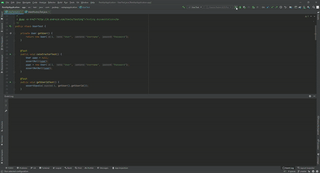

# RestApiApplication
Implementing the rest API using retrofit

Using the "https:jsonplaceholder.typicode.com/" api to fetch json files and use retrofit to convert them to POJOs.

Here's how the app works

Here are the tests running 

